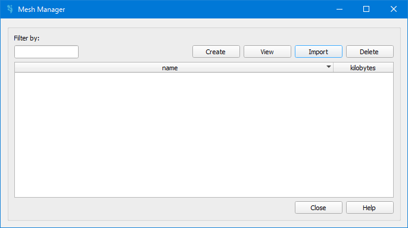

.. _dialog-mesh-manager:

===================
Dialog Mesh manager
===================

.. only:: html

    .. contents::
       :local:
       
Tool for incorporating the mesh into the model. Having a mesh is not only essential for the calculations to be done, since it defines the calculation elements;
but is also the one getting the values of the distributed parameters of the model trough its net, such as land uses or curve number for the infiltration model.
The mesh can be created or directly imported. The different scenarios created for diverse boundary conditions must be also saved to a existing mesh.

  
  Mesh manager.

The following buttons are available:

- Create: allows to create a new mesh. In the new window, we must specify:

  - Input data: checks to perform on layers to detect errors.
  - Transitions: allows the user to configure the mesh transition settings, which control how smoothly the mesh resolution decreases from the breaklines toward the interior of the domain.
    To this aim, the *Enable fine-tuned transitions* must be active.
    In this case, the user can define the value of the transition slope, the distance in which the transition begins, and the transition extent.
  - Elevation: DEM layer to obtain elevations.
  - Roughness: layer to obtain roughness values (Manning's coefficient).
  - Losses: layer to obtain loss values (Curve Number).
  - Mesh options: this field allows  to save the mesh with a specific name.
    This name will later help you identify the mesh you want to work with when assigning the boundary conditions scenario.
  
- View: allows, by selecting a mesh, see it in the ToC.
- Import: allows import a mesh from computer files.
- Export: allows export a mesh.
- Delete: allows, by selecting a mesh, delete it.