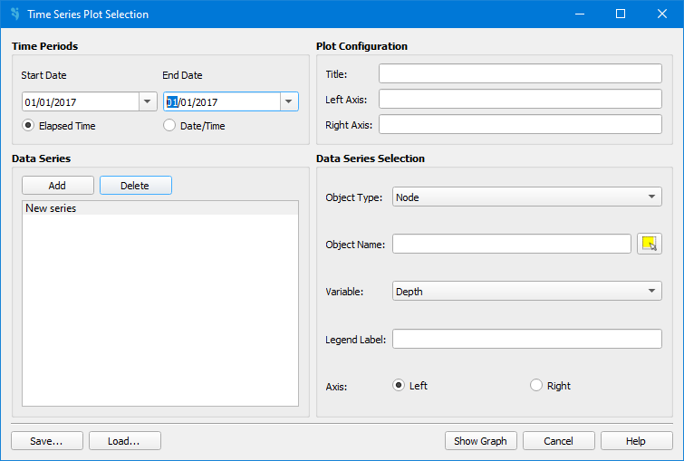
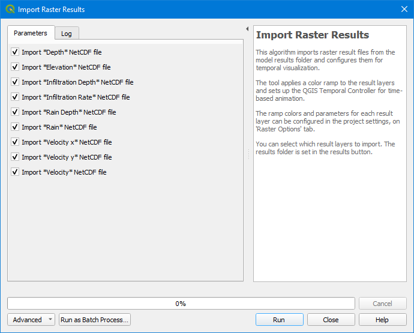
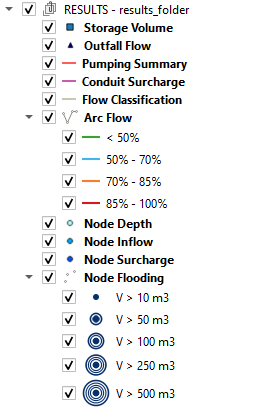

.. _dialog-results:

==============
Dialog Results
==============

.. only:: html

    .. contents::
       :local:

Tool to work with the simulation results.

.. figure:: img/results/results.png

  Window to manage the simulation results.

We can manage profile, report summary, time series graph, load raster results, load vector results and set results folder.

Profile
=======

Draws the profile, the longitudinal section between two or more nodes.

.. figure:: img/results/profile.png

  Dialog Create Profile.

The following options are available:

  - **Profile:** allows to select the initial and final nodes of the profile.

  - **Parameters:** allows to select parameters like mode or offsets. The available options are:

    - **Mode:** allows to select the mode of the profile. The available modes are: *Dry* and *With water*.
    - **Offsets:** allows to select the offsets of the profile. The available offsets are: *Depth* and *Elevation*.
    - **Timestamp:** allows to select the timestamp of the profile. There is the option to select an instant or a period.

.. important:: The *Timestamp* options will only work in *With water* mode.

After clicking on the *Draw profile* button, a new dialog will be opened with the profile.

This dialog has many options to improve the visualization of the profile, like zoom or customization of the colors.

.. figure:: img/results/profile-example.png

  Dialog Profile.

.. note:: The *Dry* mode gets the data form the project GeoPackage, while the *With water* mode gets the data form the results folder.

Report summary
==============

Provides the maximum values of the results, in a table.

.. figure:: img/results/summary.png

  Dialog Report Summary.

Time series graph
=================

Allows to visualize how flow, precipitation or water levels vary at specific points in the model.

  Dialog Create Time Series Graph.

The following options are available:

  - **Time Periods:** allows to select the time periods to be displayed.
  - **Plot Configuration:** allows to configure the plot configuration.
  - **Data Series:** allows to add, remove and select the objects to be displayed.
  - **Data Series Selection:** allows to select the objects from the canvas and their variable to be displayed.

.. note:: This tool allows to save and load the graph configuration with the *Save* and *Load* buttons.

After clicking on the *Show graph* button, a new dialog will be opened with the graph.

This dialog have many options to improve the visualization of the graph, like zoom or customization of the colors.

.. figure:: img/results/timeseries-graph-example.png

  Dialog Time Series Graph.

Load raster results
===================

Allows to load simulation results in raster format.

  Dialog Load Raster Results.

Load vector results
===================

Loads the maximum values obtained by the 1D model, in layer format with an specific style for each layer.

  Vector Results Layers.

Set results folder
==================

Sets the folder where the results are stored.
