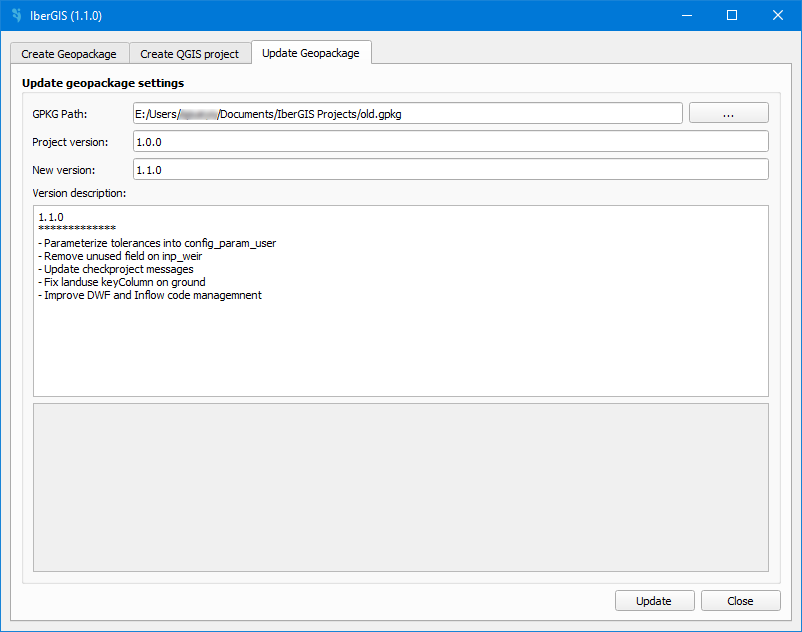

==============================
Update a IberGIS GeoPackage
==============================

.. only:: html

   .. contents::
      :local:

Tool for update a IberGIS GeoPackage to a new version.

   Window for update a GeoPackage.

By clicking in the button with three dots, we open an explorer to search the GeoPackage file.

If the GeoPackage file is valid, its version will be displayed in the *Project version* field.
Any differences between the current project version and the new version will be listed in the *Version description* field.

After selecting the GeoPackage file, we can click on the *Accept* button to update the GeoPackage.

The GeoPackage will be updated with the new data.

.. important:: This tool only supports updates from a lower version to a higher version. The minimum supported version is **1.0.0**.
